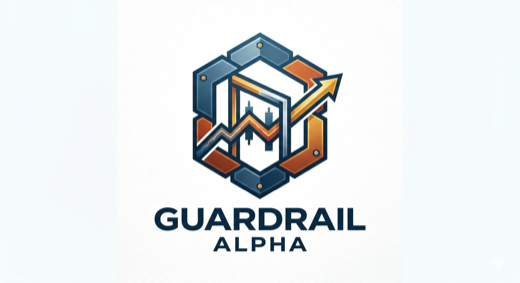
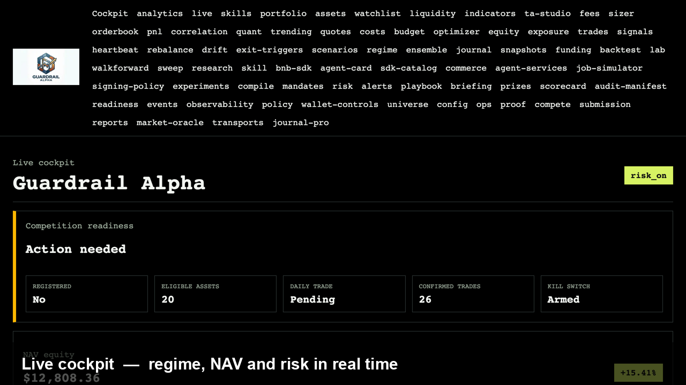
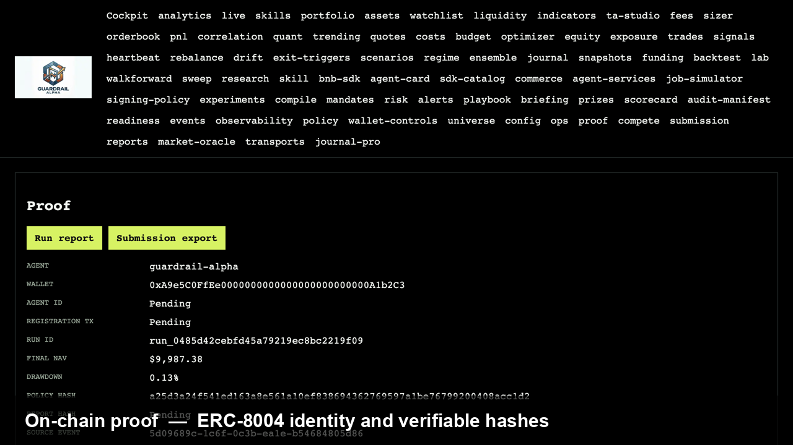

<p align="center">
  
</p>

<p align="center">
  
  
  
  
  
  
</p>

# Guardrail Alpha

**A Rust-native autonomous trading agent for BNB Smart Chain (chain id `56`).** A
plain-English mandate becomes a hashed, machine-verifiable risk policy; live
CoinMarketCap intelligence drives a regime-routed strategy; and a Rust **risk
engine is the sole gate** between intent and execution. Approved orders are
signed and executed only through the **Trust Wallet Agent Kit (TWAK)** under
self-custody — strategy code has no path to the wallet. The agent carries an
on-chain **BNB identity** (ERC-8004 / ERC-8183) with `policy_hash` / `report_hash`
proof commitments, pays for premium data per-request via **x402**, and logs every
decision to an append-only SQLite event store that is hashed and replayable. The
whole pipeline runs **offline in paper mode** against deterministic CMC + TWAK
mocks — no API keys or chain access required — and flips to live with credentials.

> Built for the **CMC × Trust Wallet × BNB Chain — Autonomous Trading Agents**
> hackathon. One codebase covers **Track 1** (live trading agent), **Track 2**
> (strategy skills), and all three special prizes (TWAK, CMC Agent Hub, BNB SDK).

## Live

| | URL |
|---|---|
| **Dashboard** (Vercel, read-only) | https://dashboard-neon-beta-80.vercel.app |
| **API** (Render, read-only) | https://guardrail-rlzb.onrender.com — [`/health`](https://guardrail-rlzb.onrender.com/health) · [`/proof`](https://guardrail-rlzb.onrender.com/proof) · [`/cockpit`](https://guardrail-rlzb.onrender.com/cockpit) |
| **Track 1 agent wallet** | [`0x0c2cC53a…f83E`](https://bscscan.com/address/0x0c2cC53a2F8368e8FFF9D277DEEAddD08Be6f83E) (BSC, chain 56) |

> The Render free instance spins down on inactivity — the first request after idle can take ~50 s to cold-start, then it's fast.

## Demo

<p align="center">
  <a href="docs/assets/product-demo.mp4">
    
  </a>
  <br/>
  <em>▶ <a href="docs/assets/product-demo.mp4">Watch the 30-second product tour</a> — cockpit → on-chain proof (ERC-8004) → Track 1 &amp; 2 → risk engine → self-custody.</em>
</p>

| Live cockpit | On-chain proof (ERC-8004) |
|---|---|
|  |  |

> 📹 Hosted walkthrough: _add your Loom / YouTube link here_

## Table of contents

- [The idea](#the-idea)
- [Hackathon fit](#hackathon-fit)
- [How it works](#how-it-works)
- [The four integrations, in depth](#the-four-integrations-in-depth)
- [Self-custody & the money-gating model](#self-custody--the-money-gating-model)
- [Strategy & risk model](#strategy--risk-model)
- [Track 2 — strategy skills](#track-2--strategy-skills)
- [Addresses & on-chain references](#addresses--on-chain-references)
- [What's inside](#whats-inside)
- [Repository layout](#repository-layout)
- [Quickstart (offline)](#quickstart-offline)
- [Going live](#going-live)
- [Deployment](#deployment)
- [Proof & verification](#proof--verification)
- [Docs](#docs)
- [License](#license)

## The idea

Most "AI trading agents" put the LLM in the trade loop — which means a prompt
injection, a hallucinated number, or a tampered API response can move real money.
**Guardrail Alpha inverts that.** The LLM is advisory only: it can translate a
natural-language mandate into a candidate policy and explain decisions, but it can
**never** authorize a swap or edit live policy. A deterministic Rust **risk engine**
is the single gate between intent and execution, and **TWAK is the only thing that
can sign** — under self-custody, with the keys never leaving the user's device.

The result is an agent a self-custody user could actually leave running unattended:
mandate in → CMC market intelligence in → regime-routed strategy → risk-gated orders
→ TWAK-signed execution out → every step hashed, logged, and independently verifiable.

## Hackathon fit

| Lane | What we built |
|---|---|
| **Track 1 — Autonomous Trading Agents** | An unattended Rust loop that reads markets via CMC, decides, and signs/executes its own BSC transactions through TWAK, inside hard risk rules (drawdown caps, token allowlist, per-trade/daily limits, slippage, stable reserve, kill switch). On-chain registration via `twak compete register`. |
| **Track 2 — Strategy Skills** | 7 regime-aware, backtestable strategy skills + a regime-ensemble meta-allocator, authored as portable specs with a skill-authoring kit, runnable through the live engine and the backtester. |
| **🏅 Best Use of TWAK** | TWAK is the **sole** execution + identity layer: local signing through the entire trade loop, autonomous-mode execution inside guardrails, native x402, and ERC-8004 identity — not a single swap call bolted onto an LLM. |
| **🏅 Best Use of CMC Agent Hub** | All CMC data flows through MCP / REST / x402 with a verifiable data→capability lineage and a packaged CMC Skill. |
| **🏅 Best Use of BNB AI Agent SDK** | Real ERC-8004 on-chain identity + ERC-8183 commerce stack, surfaced and independently verifiable on `/proof`. |

## How it works

Rust live engine (the only thing that trades) → emits an append-only event log +
run report → fanned out to read-only consumers: Python analytics, a Next.js
dashboard, SDKs, an MCP server, a Prometheus exporter, and a terminal cockpit.
Authority flows one way; nothing downstream can reach TWAK.

```
                         +-------------------------------------------------+
   CMC data  ──────────► |              LIVE ENGINE (Rust)                 |
   (REST / MCP / x402 /  |  cmc-client ─► market-data ─► feature-engine    |
    Mock)                |                 ─► strategy-engine               |
                         |                        │ intent                 |
                         |                        ▼                        |
                         |   portfolio ─► RISK-ENGINE  ◄── THE ONLY GATE   |
                         |             (pre_trade + final_quote_check)      |
                         |                        │ ApprovedOrder           |
                         |                        ▼                        |
                         |   BNB identity ◄─ twak-client ── THE ONLY EXEC  |
                         |   (ERC-8004/8183) (signs w/ user keys, x402)     |
                         |                        │ fill ─► reconcile       |
                         +------------------------┬------------------------+
                                                  │ emits (never reads back)
              ┌───────────────────┬──────────────┴───────┬──────────────────┐
              ▼                   ▼                       ▼                  ▼
        event-store         data/run_report.json    guardrail-api      guardrail-
        (SQLite)            (NAV, drawdown,          (77 GET routes,    exporter /
                            kill switch)             read-only)         metrics:9100
                                                          │
        ┌─────────────┬──────────────┬──────────────┬────┴──────┬──────────────┐
        ▼             ▼              ▼              ▼           ▼              ▼
   dashboard     web-lite       TS/Python/Go    clients/mcp  python-lab    guardrail-
   (Next.js,     cockpit        SDKs            (CMC Agent   (analytics)   tui / replay
    read-only)   (single file)  (read-only)     Hub server)               (terminal)
```

**Trust boundaries (enforced by the type system, not by convention):**

- **LLM is advisory only** — it may translate a mandate or explain a decision; it
  can never authorize a swap or edit live policy.
- **Python is analytics-only**; the **dashboard, API, and SDKs are read-only** and
  have no path back into the trading loop.
- `strategy-engine` does not depend on `twak-client` or `execution`, so executing
  without a risk approval is a **compile error, not a runtime hope**.
- The only producer of an `ApprovedOrder` is the risk engine; the only consumer that
  can sign one is `twak-client`.

Full crate graph, data/trade/risk/event flow, and trust boundaries:
[docs/ARCHITECTURE.md](docs/ARCHITECTURE.md).

## The four integrations, in depth

### 1 · Trust Wallet Agent Kit (TWAK) — the sole execution + identity layer

Install: `npm i -g @trustwallet/cli` (binary `twak`, verified **v0.19.1**). TWAK
holds the keys; this codebase never sees private key material — it shells out to the
CLI (or REST/MCP), and TWAK signs locally.

- **`crates/twak-client`** drives TWAK across four transports — `Mock` (offline
  default), `Rest`, `Mcp`, and `Cli` — behind one `TwakExecutor` trait.
- **Real trade loop on the CLI surface:** `quote_swap` (read-only `twak swap …
  --quote-only`), `execute_swap` (adds `--password`), `register_competition`
  (`twak compete register`), and `anchor_identity` (`twak erc8004 register`).
- **Credentials:** every `twak` call needs `TWAK_ACCESS_ID` + `TWAK_HMAC_SECRET`
  (from `twak setup`); signing additionally needs `TWAK_WALLET_PASSWORD`.
- **Self-custody:** the agent wallet is created with `twak wallet create`; the key
  is encrypted into the local keystore + OS keychain and never leaves the device.

### 2 · CoinMarketCap (CMC) — market intelligence

- **`crates/cmc-client`** implements all CMC data methods across `Mock`, `Rest`,
  and `Mcp` transports: latest quotes, OHLCV, Fear & Greed, DEX liquidity, token
  security, trending, global market.
- **Agent Hub:** REST (`X-CMC_PRO_API_KEY`), the official MCP endpoint
  (`https://mcp.coinmarketcap.com/mcp`, `X-CMC-MCP-API-KEY`), and the keyless x402
  MCP endpoint. A packaged CMC Skill and a `GET /cmc/capabilities` lineage map data
  fields to the capabilities they feed. See [docs/CMC_AGENT_HUB.md](docs/CMC_AGENT_HUB.md).

### 3 · x402 — pay-per-request, signed under self-custody

When a premium data endpoint answers HTTP 402, the agent builds an EIP-712 /
EIP-3009 `TransferWithAuthorization` and signs it locally, then retries with the
`X-PAYMENT` header.

- **Real signer:** [`integrations/x402-signer/x402_sign.py`](integrations/x402-signer/x402_sign.py)
  uses the BNB SDK's policy-gated `X402Signer` (recipient + per-call + session-budget
  guards on top of an EIP-712 allowlist). Keys live in the local encrypted keystore.
- **Wired + gated:** `crates/twak-client/src/x402.rs` dispatches to the real signer
  when `X402_SIGNER=bnb-sdk` (and a committed payee + `WALLET_PASSWORD` are present),
  and falls back to a deterministic offline mock otherwise — so paper runs never sign
  a real spend. Caps live in [`configs/x402/signing_policy.json`](configs/x402/signing_policy.json).

### 4 · BNB AI Agent SDK — verifiable on-chain identity

- **ERC-8004 identity:** the agent mints an on-chain identity NFT via TWAK
  (`twak erc8004 register`), surfaced with its `agentId` + mint tx on `/proof`. The
  registry, `policy_hash`, and `report_hash` are independently verifiable.
- **ERC-8183 commerce:** the vendored SDK ([`integrations/bnbagent-sdk`](integrations/bnbagent-sdk))
  provides the AgenticCommerce + EvaluatorRouter + OptimisticPolicy stack and the
  `X402Signer` used above.
- **`crates/chain-verifier`** does read-only BSC JSON-RPC checks (`eth_chainId`,
  `eth_getCode`, `eth_getTransactionReceipt`) so identity and registration are
  verified, not self-attested.

## Self-custody & the money-gating model

Every irreversible / money-spending action is gated, and the gates compose:

| Action | Gate(s) |
|---|---|
| Any order reaches execution | Must be an `ApprovedOrder` from the **risk engine** (type-enforced) |
| Live swap signing (`execute_swap`) | Client in **autonomous mode** **and** `TWAK_WALLET_PASSWORD` present — else refused |
| ERC-8004 identity mint | **Live mode** + `GUARDRAIL_ANCHOR_IDENTITY=1` + autonomous + password |
| x402 payment signing | `X402_SIGNER=bnb-sdk` + committed payee + `WALLET_PASSWORD`; policy caps enforced |
| Competition registration | Explicit `twak compete register` (on-chain tx, needs gas) |

Defaults are safe: with no credentials the whole system runs on deterministic mocks
in paper mode. The risk engine carries a kill switch, dual (pre-trade + post-quote)
checks, a stable-reserve floor, and per-trade/daily/total drawdown caps.

## Strategy & risk model

1. **Universe** — 20 eligible BEP-20 tokens on BSC ([`configs/eligible_assets.bsc.json`](configs/eligible_assets.bsc.json)); trades outside the list don't count and are rejected.
2. **Features** — momentum, volume acceleration, volatility, liquidity, sentiment, execution-quality, and a security-risk penalty.
3. **Regime** — Risk-On / Risk-Off / Chop / Breakout, derived from market + Fear & Greed inputs.
4. **Allocation** — regime-routed alpha scores → target weights → rebalance orders.
5. **Risk gate** — allowlist, position caps, daily/total drawdown, slippage, liquidity, security flags, stable reserve, trade-frequency, wallet-balance, correlation → `Approved` / `Rejected` / `Clipped`.
6. **Execution** — TWAK quote → final risk re-check against the quote → TWAK-signed swap → reconcile → event log.

## Track 2 — strategy skills

7 registered skills in [`skills/`](skills) (`skills/INDEX.json`): momentum-volatility
blend, mean-reversion (chop), trend-breakout momentum, funding-rate carry,
social-sentiment momentum, volatility-targeted risk parity, and a regime-routed
alpha. A regime **ensemble** meta-allocator blends them by regime confidence
(`GET /ensemble`, live in `crates/strategy-ensemble`). Author new ones with
`skills/_template/`, `scripts/new_skill.sh`, and `scripts/lint_skills.sh`.

## Addresses & on-chain references

**Track 1 agent (self-custody):**

| What | Address (BSC, chain `56`) |
|---|---|
| **Agent wallet** (Track 1 submission) | [`0x0c2cC53a2F8368e8FFF9D277DEEAddD08Be6f83E`](https://bscscan.com/address/0x0c2cC53a2F8368e8FFF9D277DEEAddD08Be6f83E) — created via `twak wallet create`; keys stay on-device |
| **Competition contract** | [`0x212c61b9b72c95d95bf29cf032f5e5635629aed5`](https://bsctrace.com/address/0x212c61b9b72c95d95bf29cf032f5e5635629aed5) — register with `twak compete register` |

**BNB AI Agent SDK — identity & commerce (mainnet `56` / testnet `97`):**

| Contract | Mainnet (56) | Testnet (97) |
|---|---|---|
| ERC-8004 Identity Registry | [`0x8004A169…a432`](https://bscscan.com/address/0x8004A169FB4a3325136EB29fA0ceB6D2e539a432) | `0x8004A818…BD9e` |
| ERC-8183 AgenticCommerce | `0xea4daa31…6eba6` | `0xa206c051…3b0de` |
| ERC-8183 EvaluatorRouter | `0x51895229…cd6da` | `0xd7d36d66…f66f25` |
| ERC-8183 OptimisticPolicy | `0x9c018457…66de5` | `0x4f4678d4…b78a6` |

**x402 payment token** (EIP-3009, signed by the TWAK self-custody signer): mainnet [`0xcE24439F2D9C6a2289F741120FE202248B666666`](https://bscscan.com/address/0xcE24439F2D9C6a2289F741120FE202248B666666) · testnet `0xc70B8741…48E5565` · policy: [`configs/x402/signing_policy.json`](configs/x402/signing_policy.json).

**Eligible trading universe:** 20 BEP-20 tokens, all `chain_id 56` — [`configs/eligible_assets.bsc.json`](configs/eligible_assets.bsc.json). The ERC-8004 `agentId` + mint tx populate on `/proof` after a live autonomous anchor run.

## What's inside

All counts verified against the repo:

| Surface | Count | Where |
|---|---:|---|
| Rust crates (live engine) | **28** | `crates/` |
| Binaries (apps) | **9** | `apps/` |
| Read-only API routes (`GET`) | **77** | `apps/guardrail-api/src/server.rs` |
| Track-2 strategy skills (registered) | **7** | `skills/INDEX.json` |
| Dashboard pages (Next.js) | **74** | `dashboard/src/app/**/page.tsx` |
| Ecosystem clients | **11** | `clients/` |
| Eligible BSC universe | **20** tokens, all `chain_id 56` | `configs/eligible_assets.bsc.json` |

The **9 binaries** are `guardrail-agent` (the only one that trades), `guardrail-api`,
`guardrail-cli`, `guardrail-tui`, `guardrail-monitor`, `guardrail-exporter`,
`guardrail-replay`, `guardrail-sim`, and `guardrail-doctor`. The **11 clients** are
`typescript` (`@guardrail/client`), `python` (`guardrail_client`), `go` (read-only
SDK + `guardrailctl`), `go-cli` (`grctl`), `ts-terminal` (`guardrail-term`), `mcp`
(CMC Agent Hub server), `langchain`, `postman`, `proof-verifier` (clean-room
verifier), `web-lite` (cockpit), and `examples`.

## Repository layout

```
guardrail/
├── crates/                 # 28 Rust crates — the live engine
│   ├── cmc-client/         #   CMC data (Mock/REST/MCP/x402)
│   ├── market-data/        #   normalized snapshots
│   ├── feature-engine/     #   signals
│   ├── strategy-engine/    #   regime + allocation (no exec dependency)
│   ├── strategy-ensemble/  #   regime-routed meta-allocator
│   ├── risk-engine/        #   THE sole gate (checks, sizing, kill switch)
│   ├── twak-client/        #   THE sole executor + ERC-8004 identity + x402
│   ├── bnb-agent/          #   ERC-8004/8183 records + proof artifacts
│   ├── chain-verifier/     #   read-only BSC RPC verification
│   ├── event-store/        #   append-only SQLite log
│   └── …                   #   portfolio, backtester, indicators, etc.
├── apps/                   # 9 binaries (guardrail-agent is the only trader)
├── dashboard/              # Next.js read-only cockpit (74 pages) → Vercel
├── clients/                # 11 ecosystem clients (SDKs, MCP, web-lite, verifier)
├── services/               # out-of-process read-only services (gateway, bots…)
├── integrations/
│   ├── bnbagent-sdk/        #   vendored BNB AI Agent SDK (ERC-8004/8183, X402Signer)
│   └── x402-signer/         #   real x402 EIP-3009 signer helper
├── skills/                 # 7 Track-2 strategy skills + authoring kit
├── configs/                # risk policy, eligible assets, x402 signing policy…
├── python-lab/             # analytics, charts, reports (no keys, no trading)
├── infra/ · deploy/        # Dockerfiles, compose, k8s, helm
├── Dockerfile · render.yaml # Render API deploy
└── docs/                   # architecture, runbooks, demo scripts, prize map
```

## Quickstart (offline)

Everything below runs **offline in paper mode** — no keys, no network, no chain.

```bash
# 1. Build the Rust workspace
cargo build

# 2. Full offline end-to-end demo: paper run + API on :8080 + web-lite cockpit
scripts/demo.sh

# 3. Capture a paper run + proof artifacts (run report, submission.md, verifier)
scripts/capture_submission.sh
```

Run the pieces individually:

```bash
# Paper trading agent — bounded run, writes SQLite events + run report
GUARDRAIL_CYCLES=3 cargo run -p guardrail-agent -- --config configs/paper.toml

# Read-only HTTP API on :8080
cargo run -p guardrail-api

# Next.js dashboard on :3000
cd dashboard && pnpm install && pnpm dev

# Zero-build web-lite cockpit (open in a browser, wire to the API)
open clients/web-lite/index.html        # then point it at http://localhost:8080

# Terminal cockpit, audit replay, walk-forward analysis
cargo run -p guardrail-tui
cargo run -p guardrail-replay -- journal
cargo run -p guardrail-cli -- walk-forward --config configs/paper.toml
```

`make setup`, `make paper`, `make api`, `make dashboard`, `make exporter`, and
`make replay` wrap the common flows. `scripts/guardrail.sh up` is the unified
operator front door. `docker compose up --build` brings up the full stack;
`deploy/k8s` carries Kustomize manifests and `deploy/helm` a Helm chart.

## Going live

A real **live** run uses `scripts/compete.sh` and stays on deterministic mocks
unless every credential is present:

```bash
# 1. Install + authenticate TWAK (creates ~/.twak credentials)
npm i -g @trustwallet/cli
twak setup                      # paste Access ID + HMAC Secret from portal.trustwallet.com

# 2. Create the self-custody agent wallet (key stays on-device)
twak wallet create
twak wallet address --chain bsc # ← your agent address

# 3. Fund it: a little BNB for gas + an eligible BEP-20 token for capital
# 4. Register on-chain before the trading window
twak compete register
twak compete status

# 5. Go live (env: CMC_API_KEY, TWAK_ACCESS_ID, TWAK_HMAC_SECRET,
#    TWAK_WALLET_PASSWORD, BSC_RPC_URL)
scripts/compete.sh
```

Full runbook: [docs/LIVE_RUNBOOK.md](docs/LIVE_RUNBOOK.md). Longer step-by-step:
[docs/QUICKSTART.md](docs/QUICKSTART.md).

## Deployment

| Component | Platform | How |
|---|---|---|
| **Dashboard** | Vercel | Next.js app in `dashboard/`; auto-deploys on push. Set `NEXT_PUBLIC_API_URL` to the API URL so it pulls live data. |
| **API** | Render | [`render.yaml`](render.yaml) Blueprint (or a plain Docker service using the root [`Dockerfile`](Dockerfile)); honors Render's `$PORT`; a deterministic paper dataset is baked into the image so the dashboard shows real data immediately. |

The dashboard is wired to the live API via `NEXT_PUBLIC_API_URL=https://guardrail-rlzb.onrender.com`.
See [docs/VERCEL_DEPLOY.md](docs/VERCEL_DEPLOY.md).

## Proof & verification

Everything tying the running agent to its commitments is deterministic and
inspectable offline:

```bash
cargo run -p guardrail-cli -- policy compile "<mandate>"   # validated policy + SHA-256 hash
cargo run -p guardrail-cli -- identity                     # agent id, ERC-8004 record, proof hashes
cargo run -p guardrail-replay -- summary                   # proposed vs rejected vs confirmed
bash scripts/verify_proof.sh                               # independent clean-room proof check
```

The append-only event log (`data/guardrail_alpha.db`) and run report
(`data/run_report.json`) are the book of record; `./scripts/export_report.sh`
writes `data/exports/submission.md`. The `/proof` endpoint and the
`clients/proof-verifier` recompute the policy/report hashes and (with `BSC_RPC_URL`)
validate the on-chain contract + registration independently. Copy-pasteable
walkthrough: [docs/JUDGE_DEMO.md](docs/JUDGE_DEMO.md) and
[docs/DEMO_SCRIPT.md](docs/DEMO_SCRIPT.md); Track 1 requirement map:
[docs/SUBMISSION_CHECKLIST.md](docs/SUBMISSION_CHECKLIST.md).

## Docs

- **[docs/INDEX.md](docs/INDEX.md)** — master table of contents for all documentation.
- **[docs/PRODUCT_OVERVIEW.md](docs/PRODUCT_OVERVIEW.md)** — high-level product tour and system map.
- **[docs/ARCHITECTURE.md](docs/ARCHITECTURE.md)** — crate graph, flows, and trust boundaries.
- **[docs/QUANT.md](docs/QUANT.md)** — the quant suite (6 tools × crate/API/page/SDK/CLI).
- **[docs/CMC_AGENT_HUB.md](docs/CMC_AGENT_HUB.md)** — CMC data → capability lineage.
- **[docs/LIVE_RUNBOOK.md](docs/LIVE_RUNBOOK.md)** — taking the agent live (real keys, go-live).
- **[PLAN_V2.md](PLAN_V2.md)** — expansion roadmap (offline-safe).
- Earlier competition writeups: **[docs/archive/hackathon/](docs/archive/hackathon/)**.

## Tech stack

**Rust** (tokio, axum, sqlx/SQLite, reqwest, clap, serde, rust_decimal) for the
engine and API · **TypeScript / Next.js 16 / React 19** for the dashboard ·
**Python** (analytics + the x402 signer via the BNB SDK) · **Trust Wallet Agent
Kit** for execution + identity · **CoinMarketCap Agent Hub** for data · **x402**
for pay-per-request · **BNB Chain** (ERC-8004 / ERC-8183).

## License

MIT — see [LICENSE](LICENSE).
